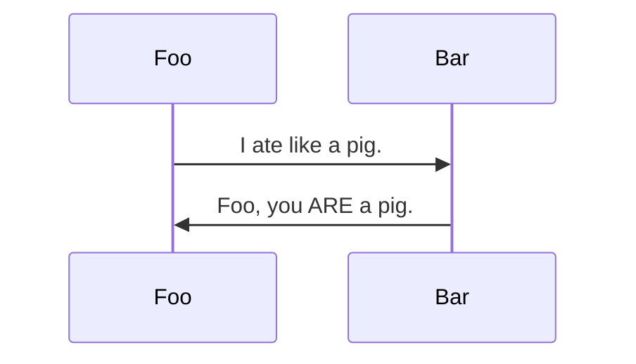

# zero-md

 


## Getting Started

- [Overview](#overview)
- [Installation](#installation)
- [Usage](#usage)
- [Baked-in features](#baked-in-features)

## Overview

> Ridiculously simple zero-config markdown displayer

A zero-config web component that converts markdown to HTML. Built on the
[Custom Elements V1 specification](https://www.w3.org/TR/custom-elements/), it renders markdown
inside a self-contained Shadow DOM container. Under the hood, it uses
[`marked`](https://github.com/markedjs/marked) for parsing and
[`highlight.js`](https://github.com/highlightjs/highlight.js) for syntax highlighting.

### Key Features

- **Math rendering** via [`KaTeX`](https://github.com/KaTeX/KaTeX)
- **Diagrams** via [`Mermaid`](https://github.com/mermaid-js/mermaid)
- **Syntax highlighting** with auto-language detection
- **Hash-link scroll handling** for anchor navigation
- **FOUC prevention** (Flash of Unstyled Content)
- **Auto re-render** when inputs or attributes change
- **Light and dark themes** out of the box
- **Spec-compliant extensibility**

> [!IMPORTANT]
>
> Markdown files must be served over HTTP/HTTPS. Browsers restrict local file access (via the
> `file://` protocol) due to security policies, and standard
> [CORS](https://developer.mozilla.org/en-US/docs/Web/HTTP/CORS) rules apply.

## Installation

### Load via CDN (Recommended)

To load `zero-md` with its default settings, import the script directly from CDN:

```html
<head>
  <!-- Import element definition and auto-register -->
  <script type="module" src="https://cdn.jsdelivr.net/npm/zero-md@3?register"></script>
</head>
<body>
  <zero-md src="example.md"></zero-md>
</body>
```

> [!TIP]
>
> Use the `?register` query parameter to automatically register the custom element as `<zero-md>`.

If you prefer to define the element manually, omit the query parameter and use
`customElements.define()`:

```html
<head>
  <script type="module">
    // Import element definition
    import ZeroMd from 'https://cdn.jsdelivr.net/npm/zero-md@3'
    // Register manually
    customElements.define('zero-md', ZeroMd)
  </script>
</head>
```

### Use in Web Projects

Install the package via npm:

```text
npm i zero-md
```

Import and register the element in your JavaScript application:

```js
import ZeroMd from 'zero-md'

// Register the custom element
customElements.define('zero-md', ZeroMd)
```

For a self-contained, pre-bundled package, check out
[`zero-md-bundled`](https://github.com/zerodevx/zero-md-bundled).

## Usage

### Display an External Markdown File

Set the `src` attribute to the URL of the markdown file:

```html
<zero-md src="https://example.com/markdown.md"></zero-md>
```

### Write Inline Markdown

To write markdown directly inside your HTML, wrap the content in a `<script type="text/markdown">`
tag and omit the `src` attribute:

<!-- prettier-ignore -->
```html
<zero-md>
  <script type="text/markdown">
# This is my [markdown](https://example.com)
  </script>
</zero-md>
```

> [!NOTE]
>
> `zero-md` first attempts to load from the `src` attribute. If `src` is missing or fails to load,
> it falls back to the inline markdown inside the `<script>` tag.

### Default Style Template

By default, `zero-md` styles markdown using a theme that mimics GitHub (supporting both light and
dark modes). Specifying:

```html
<zero-md src="example.md"></zero-md>
```

is equivalent to manually defining the following style template:

<!-- prettier-ignore -->
```html
<zero-md src="example.md">
  <template>
    <!-- Sensible host style defaults -->
    <style>
      :host { display: block; position: relative; contain: content; }
      :host([hidden]) { display: none; }
    </style>

    <!-- Github markdown styles (light/dark) -->
    <link rel="stylesheet" href="https://cdn.jsdelivr.net/npm/github-markdown-css@5/github-markdown.min.css" />

    <!-- Highlightjs Github theme (light) -->
    <link rel="stylesheet" href="https://cdn.jsdelivr.net/npm/@highlightjs/cdn-assets@11/styles/github.min.css" />

    <!-- Highlightjs Github theme (prefers dark) -->
    <link rel="stylesheet" media="(prefers-color-scheme:dark)" href="https://cdn.jsdelivr.net/npm/@highlightjs/cdn-assets@11/styles/github-dark.min.css" />

    <!-- KaTeX styles (needed for math) -->
    <link rel="stylesheet" href="https://cdn.jsdelivr.net/npm/katex@0/dist/katex.min.css" />
  </template>
</zero-md>
```

### Custom Style Template

You can override the default styles by supplying your own `<template>` containing custom `<style>`
or `<link>` tags:

```html
<zero-md src="example.md">
  <template>
    <style>
      h1 {
        color: red;
      }
    </style>
    <link rel="stylesheet" href="custom-markdown-styles.css" />
  </template>
</zero-md>
```

### Append or Prepend Styles

To add custom styles without losing the default GitHub styles, add `data-append` or `data-prepend`
to your `<template>` tag:

```html
<zero-md src="example.md">
  <!-- This template is applied after the default styles -->
  <template data-append>
    <style>
      h1 {
        color: red;
      }
    </style>
  </template>
</zero-md>
```

### Full Example

Here is how you can combine custom styles, fallback content, and inline markdown:

<!-- prettier-ignore -->
```html
<zero-md src="example.md">
  <template>
    <link rel="stylesheet" href="markdown-styles.css" />
    <style>
      h1 { color: red; }
    </style>
    <link rel="stylesheet" href="highlight-styles.css" />
    <style>
      code { background: yellow; }
    </style>
  </template>
  <script type="text/markdown">
This is the fallback markdown. It will only show if `src` is missing or fails to load.
  </script>
</zero-md>

<style>
  zero-md {
    display: block;
    position: relative;
  }
</style>
```

## Baked-in features

> [!NOTE]
>
> To optimize performance, external libraries (like KaTeX and Mermaid) are dynamically imported from
> CDN only when they are needed.

### Marked Extensions

The following extensions are loaded by default to extend the markdown parser:

| Extension                                                                              | Description                                                                                      |
| -------------------------------------------------------------------------------------- | ------------------------------------------------------------------------------------------------ |
| [`marked-base-url`](https://github.com/markedjs/marked-base-url)                       | Sets the base URL relative to `src` so nested asset links resolve correctly.                     |
| [`marked-highlight`](https://github.com/markedjs/marked-highlight)                     | Sets up syntax highlighting using [`highlight.js`](https://github.com/highlightjs/highlight.js). |
| [`marked-gfm-heading-id`](https://github.com/markedjs/marked-gfm-heading-id)           | Generates GitHub-style heading IDs for anchor links.                                             |
| [`marked-alert`](https://github.com/bent10/marked-extensions/tree/main/packages/alert) | Supports GitHub-style [alerts](https://github.com/orgs/community/discussions/16925).             |

### Math

Write mathematical equations using LaTeX syntax, matching
[GitHub's math formatting](https://docs.github.com/en/get-started/writing-on-github/working-with-advanced-formatting/writing-mathematical-expressions).
Three styles are supported:

#### Inline Math

```text
$\sqrt{3x-1}+(1+x)^2$
```

Renders as: $\sqrt{3x-1}+(1+x)^2$

#### Block-level Math

```text
$$
\sqrt{3x-1}+(1+x)^2
$$
```

Renders as:

$$
\sqrt{3x-1}+(1+x)^2
$$

#### Math Code Block

````text
```math
\sqrt{3x-1}+(1+x)^2
```
````

Renders as:

```math
\sqrt{3x-1}+(1+x)^2
```

Configure custom KaTeX options globally using the
[load function](./advanced-usage.md#katex-options).

### Mermaid Diagrams

Generate diagrams using ` ```mermaid ` code blocks:

````text

````

Renders as:


